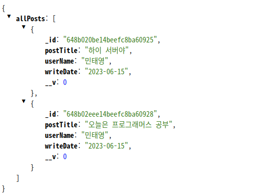

## my-blog

### 1. 프로젝트 설명

#### 1-1. 개발환경
- node v 20.1.0
- mongoDB v 4.4.22

#### 1-2. 폴더구조
-  module
    - date.js      // 시간을 리턴하는 모듈
- routes
    - comments.js  // 댓글 추가, 수정, 삭제, 불러오기기능의 router파일
    - posts.js     // 게시글 추가, 수정, 삭제, 조회 기능의 router파일
- schema
    - commentsjs   // 댓글컬렉션의 데이터를 저장할 구조를 정의한 schema파일
    - index.js     // mongoose와 연동하여 local//127.0.0.1:27017/my_blog에 있는 몽고DB데이터베이스와 연결을 정의한 파일
    - posts.js     // 게시글컬렉션의 데이터를 저장할 구조를 정의한 schema파일의

- gitignore        // github에 프로젝트를 올릴때 node_module을 제외
- app.js           // 현 프로젝트의 root파일

### 2. 코드의 기본흐음
#### 1) 게시글저장
(1) /api/posts에 HTTP메소드의 POST로 postTitle, userName, password, content를 body로 보낸다.

(2) 위의 4개의 스키마는 모두 필수이므로 하나라도 빠지면 에러가 난다.

#### 2) 게시글 전체조회 
(1) /api/posts HTTP메소드의 GET으로 req을 보낸다. 

### 3) 게시글 수정
(1) /api/posts/:id HTTP메소드의 PUT으로 수정하고자 하는 게시글의 고유ID값을 보낸다. 

(2) req.body에 데이터베이스에 저장된 password와 newContent내용을 입력하여 보낸다.

(3) 클라이언트에서 보낸 password와 저장된 password를 대조하여 일치하면 newContent의 내용으로 수정한다.

### 4) 게시글 조회
(1) /api/posts/:id HTTP메소드의 GET으로 게시글의 고유ID값을 보낸다.

### 5) 게시글 삭제 
(1) /api/posts/:id HTTP메소드의 DELETE로 게시글의 고유ID값과 body로 password를 보낸다. 

(2) params로 보내진 postId로 데이터베이스에 저장된 게시글과 해당게시글의 ID값을 가지고 있는 댓글을 찾는다.

(3) req.body로 보내진 password와 대조하여 일치하면 해당게시글과 게시글에 달린 댓글(해당게시글의 ID값을 갖는 댓글)을 모두 삭제한다.

### 6) 댓글저장
(1) /api/posts/comments HTTP메소드 POST로 postId, userName, content, password를 보낸다. 

### 7) 댓글조회 
(1) /api/posts/:postId/comments HTTP메소드 GET으로 요청을 보낸다.

(2) postId를 params로 받아 해당 postId값을 가진 comment들을 req로 반환한다.

### 8) 댓글수정
(1) /api/posts/comments HTTP메소드 PUT으로 댓글의 commentId, password, newContent를 보낸다.

(2) 먼저 해당 댓글이 존재하는지 commentId로 찾고 있으면 password를 대조한다.

(3) 대조한 password가 일치하면 newContent에 담긴 내용으로 수정한다. 

### 9) 댓글삭제
(1) /api/posts/comments HTTP메소드 DELETE로 req.body에 commentId와 password를 보낸다. 

(2) commentId로 댓글을 조회 없으면 해당댓글이 존재하지 않는다는 에러가 나온다.

(3) 있으면 password와 대조하여 일치하면 삭제한다. 

## 보완할점 
(1) 댓글을 조회하면 password까지 불러와진다.. 그리고 password를 그대로 데이터베이스에 저장하고 있기때문에 보완이 좋지않다.
=> bcypt를 install히여 password를 감싸고 댓글조회시 find에 password: false로 조회목록에서 제외를 해야한다.
